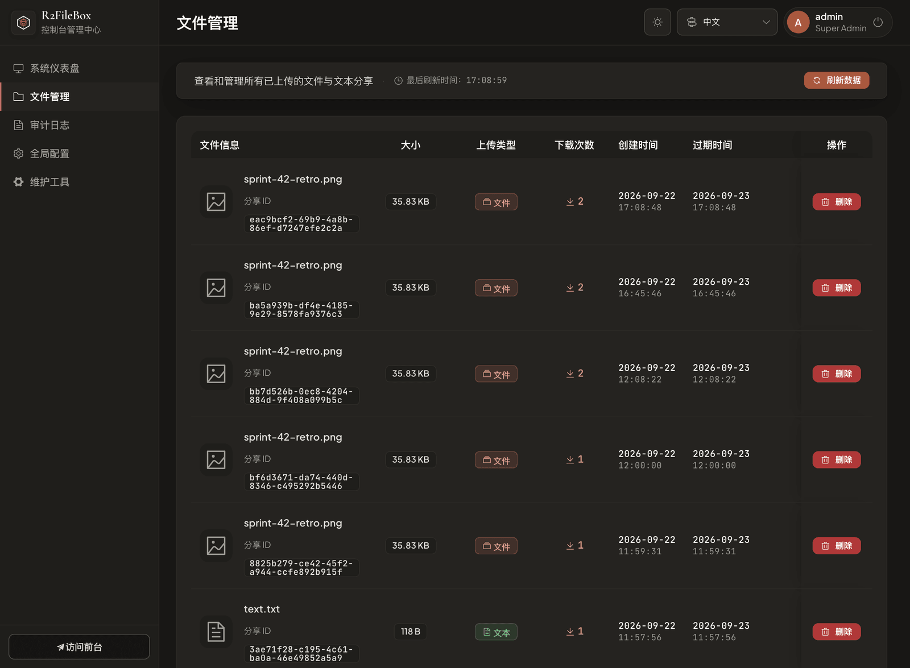

# R2FileBox

[](https://github.com/workHMZ/r2filebox/actions/workflows/ci.yml)
[](https://github.com/workHMZ/r2filebox/actions/workflows/codeql.yml)
[](https://github.com/workHMZ/r2filebox/security/dependabot)
[](https://github.com/workHMZ/r2filebox/security)
[](https://github.com/workHMZ/r2filebox/releases/latest)
[](./LICENSE)

**你自己的取件柜。** 丢一个文件进去，拿到一串取件码，把码发给对方——没有注册，没有登录，没有网盘客户端。

跑在 Cloudflare Workers + R2 + D1 上，支持一键部署，适合个人文件与文本分享。

[中文](#中文) · [English](#english) · [日本語](#日本語)

[](https://deploy.workers.cloudflare.com/?url=https://github.com/workHMZ/r2filebox)

| 用户端 · 分享与取件 | 管理端 · 监控与运维 |
|:---:|:---:|
| [](./docs/screenshots/home-file-share.png) | [](./docs/screenshots/admin-dashboard.png) |
| 放一个文件进去（中文 · 浅色） | 系统仪表盘（English · Light） |
| [](./docs/screenshots/share-created.png) | [](./docs/screenshots/admin-files.png) |
| 取件凭据 · 二维码（日本語 · ライト） | 文件与凭据管理（中文 · 深色） |
| [](./docs/screenshots/pickup-file.png) | [](./docs/screenshots/admin-maintenance.png) |
| 取件提取 · 在线预览（English · Dark） | 系统维护与存储架构（日本語 · ダーク） |

---

## 中文

### 怎么用

1. 拖一个文件进去，或者直接粘一段文本。
2. 拿到取件码、分享链接和二维码，随便挑一个发给对方。
3. 对方输码、点链接、扫码都行，直接下载。两边都不用注册。

每份分享都有自己的有效期和取件次数。到期或次数用完后不能再发起新的取件；已取得的文件下载会话在其期限内仍可使用，过期内容由定时任务清理。

### 几件值得说的事

**秒传，但没有「哈希查询」接口。**
第二次上传同一个文件时不用再传一遍——这是常见功能，但常见实现往往开一个「这个哈希存在吗」的接口，于是任何人都能拿一个文件去问服务器「别人传过这个吗」。这里不一样：秒传需要你**上次自己传成功时服务端签发、并存在你本地的凭证**。没有这张凭证就老老实实传。服务器不回答任何关于别人内容的问题。

**大文件断了能接着传。**
文件按 8 MiB 分片，进度存在本地。网断了、页面关了、手机切后台了，在 24 小时上传会话有效期内回来重选同一个文件，就从断点继续。上传进度按字节走，不是一片一跳。

**看视频不会把取件次数用光。**
取件次数按「取件」算，不按 HTTP 请求算。输一次码换一份最长 1 小时、且不超过分享有效期的下载会话。会话有效期间拖进度条、断点续传、浏览器自动重试都不再扣次数；浏览器允许标签页缓存时，在同一个标签页里刷新取件页也不会再扣。

**同样的内容只占一份空间，但每个分享各过各的。**
两个人分享同一个文件，R2 里只有一份对象，但两个分享的取件码、有效期、次数互不相干。删掉其中一个不会影响另一个；只有最后一个引用也消失了，实体文件才真正删除。

**改配置不用重新部署。**
有效期上限、取件次数、单文件大小、开关文本/文件分享、是否上人机验证，都在后台点一下就生效。

**装到桌面，接进系统分享菜单。**
支持 PWA 安装；在支持 Web Share Target 的浏览器和系统中，安装后可从其他 App 的分享菜单接收文本和链接，不接收文件。

**跑起来就不用管了。**
每小时一次的定时任务负责清过期分享、回收没人引用的物理文件、abort 掉半截的分片上传。R2 删除失败会留记录下次重试。

### 部署

> [!IMPORTANT]
> Cloudflare 要求账户绑定支付方式才能开通 R2。**没绑支付方式，不管哪种部署方式都会卡在创建 R2 桶这一步。** R2 本身有免费额度，绑卡不等于扣费。

#### 一键部署

点上面的 **Deploy to Cloudflare** 按钮，页面里填两行命令：

```text
Build command:  npm run build
Deploy command: npm run deploy
```

然后填三个密钥：

| 密钥 | 怎么来 |
|---|---|
| `ADMIN_PASSWORD` | 你自己想一个，16–4096 字符。**这个 Cloudflare 不会帮你找回，先存好。** |
| `CODE_HASH_PEPPER` | `openssl rand -hex 32` |
| `SESSION_SECRET` | `openssl rand -hex 32` |

后两个生成一次就别再动了：换 `CODE_HASH_PEPPER` 会让所有已发出的取件码失效，换 `SESSION_SECRET` 会踢掉所有登录态和下载会话。

`ADMIN_USERNAME` 可选，默认 `admin`。Turnstile 默认关闭；启用前需在 Worker 配置 `TURNSTILE_SECRET_KEY` Secret，并在后台填写对应的 Site Key。

#### 命令行部署

想要自动生成密码哈希、自动建资源的，用这个：

```bash
npm ci
npm run deploy:cf
```

一路问下来：建（或复用）R2 桶和 D1 库、把 `database_id` 写回本地 `wrangler.toml`、让你设管理员密码并**用 PBKDF2 哈希后**存成 Secret、跑迁移、发布。检测到已有资源时它不会自作主张换密钥。

需要 Node.js 24（`>=24.11.0 <25`，`.nvmrc` 里钉好了）。

> [!WARNING]
> **执行 2.5.0 迁移后，不能回退到 2.4.x 或更早版本。** `0003_instant_upload.sql` 让多个分享共用一个 R2 对象，而 2.4.x 的清理逻辑还以为「一个分享独占一个对象」，退回去会删掉别人还在用的文件。出事就先在后台关掉公开上传，然后往前修。任何时候迁移都要先于 Worker 部署。

### 默认值

| | |
|---|---|
| 单文件 | 50 MiB，后台可调 1–95 MiB |
| 总容量 | 8 GiB 软限制，满了停止接收新内容，不动已有的 |
| 有效期 | 24 小时，上限 168 小时 |
| 取件次数 | 10 次 |
| 自动清理 | 每小时一次 |

95 MiB 是当前分片数量下的实现上限，不是 R2 的限制。

### 本地跑

```bash
cp .dev.vars.example .dev.vars   # 填好里面的三个值
npm ci
npm run build
npm run db:migrate:local
npm run dev                      # http://localhost:8787
```

改完前端要重新 `npm run build`，Wrangler 才会读到新产物。`.dev.vars` 不要提交。

```bash
npm run verify          # 配置、资源、三语、类型、脚本、Worker 测试一起过
npm run deploy:dry-run  # 构建并验证部署包，不上传
```

### 说清楚：这不是端到端加密

Worker 必须能读到内容才能发给对方，所以它读得到。安全边界来自私有 R2 桶、只存哈希的取件码、短命的下载会话，以及所有访问都过 Worker 这一道。真正敏感的东西，上传前自己加密——打个带密码的压缩包就行。

审计日志和限流记录里只有 IP 的单向哈希，没有明文 IP。

<details>
<summary>实现细节（给想看代码的人）</summary>

| 层 | 用了什么 | 干什么 |
|---|---|---|
| 边缘 | Hono + Workers | API、鉴权、安全头、流式下载、定时清理 |
| 对象存储 | R2（私有桶） | 文件正文和文本正文 |
| 数据库 | D1 | 分享元数据、物理 blob 引用、上传会话、回收 outbox、设置、审计日志、精确限流 |
| 前端 | Vue 3 + Element Plus | 用户界面和后台，走 Workers Static Assets |
| 观测 | Analytics Engine + Rate Limiting | 轻量指标、边缘粗粒度限流 |

- **秒传协议**：客户端算覆盖全文件的树指纹；Worker 收每个分片时流式算 SHA-256，签发一张绑定了上传会话、分片序号、分片大小和哈希的收据；完成时校验全部收据并重算树根。伪造树根、篡改收据、跨会话复用收据都会被拒。
- **取件码**：只存 `SHA-256(pepper + ":" + code)`。随机码用拒绝采样保证字符分布无偏，字母表剔掉了 `0/O/1/l/I`。
- **下载令牌**：Web Crypto 手写的 HMAC-SHA256 JWT，不引第三方库；作用域限定到单个分享，`HttpOnly` + `SameSite=Strict` + Path 锁死到该分享的下载路径。
- **容量计数是 O(1)**：D1 触发器在写入时维护 `storage_usage` 汇总行，统计物理 blob、文本正文、未完成上传及待清理上传的预留。容量读取本身不用扫分享表；后台其他统计仍会聚合分享记录，重复分享同一 blob 不重复占额度。
- **限流分两层**：Workers 原生 Rate Limiting 在边缘粗筛，D1 时间窗计数器做跨节点的精确限制，主要防取件码被枚举。
- **回收是可重试的**：删除/过期只动逻辑分享；最后一个引用消失后物理 blob 才进 orphan outbox，Cron 先删 R2 对象再删 outbox 行，删失败就留着下次重试。半截的分片上传走同一套 outbox。
- **CSP 分路由**：API 和后台走严格策略，静态资源走宽松策略。SVG 这类能带脚本的格式一律强制下载，不做内联预览。
- **错误码三级回退**：后端返稳定的 ErrorCode + 参数 + 英文兜底文案，前端按 ErrorCode 本地化 → 原始 message → 通用兜底依次取。
- **CI 护栏**：`verify-config.mjs` 断言 `wrangler.toml` 里的 D1 `database_id` 还是占位符（防止真实生产库 ID 被提交）、限流 namespace 不冲突、Deploy 按钮的密钥说明和 `.dev.vars.example` 同步。

定时清理每小时执行，默认最多 3 轮，每轮处理最多 100 条过期分享，并分批处理回收记录和历史数据；遇到失败或达到时间预算时可能提前结束。实际 CPU 和 D1 读写量取决于数据规模，不能把一次空跑的数字当成固定成本。[Cloudflare 的额度说明](https://developers.cloudflare.com/workers/platform/limits/#cpu-time)列明免费版单次 CPU 上限为 10 ms，付费版 Cron 间隔不足一小时为 30 秒、一小时及以上为 15 分钟。调高 `maxPasses` 前仍应检查实际 CPU、查询量和失败日志。

</details>

### 许可

**LGPL-3.0-or-later** · [LICENSE](./LICENSE) · [THIRD_PARTY_NOTICES.md](./THIRD_PARTY_NOTICES.md)

灵感来自 [FileCodeBox](https://github.com/vastsa/FileCodeBox) 和它的 [Go 实现](https://github.com/zy84338719/FileCodeBox)。本项目是独立的 Cloudflare Workers 实现。

---

## English

**Your own pickup locker.** Drop a file in, get a short code, send the code. No sign-up, no login, no desktop client.

Runs on Cloudflare Workers + R2 + D1, with one-click deployment for personal file and text sharing.

### How it works

1. Drag in a file, or paste some text.
2. You get a pickup code, a share link, and a QR code. Send whichever is convenient.
3. They type the code, open the link, or scan it. Neither of you needs an account.

Every share has an expiry and pickup budget. Once either is reached, new pickups stop. An existing file download session remains usable until its own deadline; the scheduled job cleans up expired content.

### Things worth pointing out

**Instant re-upload, without a hash oracle.**
Uploading the same file twice doesn't retransmit it. That part is common; the usual implementation isn't. Most of them expose a "does this hash exist?" endpoint, which lets anyone probe whether some file has been uploaded by someone else. Here, skipping the transfer requires a **capability the server signed for you on your own successful upload**, cached in your browser. No capability, no shortcut. The server never answers questions about other people's content.

**Big uploads survive a dropped connection.**
Files go up in 8 MiB parts and progress is kept locally. Lose your network, close the tab, background the app on a phone — pick the same file again within the 24-hour upload session and it resumes where it stopped. The progress bar moves by bytes, not one jump per part.

**Watching a video doesn't burn the pickup budget.**
A pickup is counted once per pickup, not once per HTTP request. Entering the code opens a download session lasting up to one hour, capped by the share expiry. While that session is valid, seeking, resuming, and browser retries cost no extra pickups. Reloading the pickup page in the same tab also preserves the pickup when browser session storage is available.

**Identical content is stored once, but shares stay independent.**
Two people sharing the same file means one object in R2 — yet each share keeps its own code, expiry, and pickup count. The physical object is deleted only when the last reference to it goes away.

**Settings change without a redeploy.**
Expiry ceiling, pickup limit, max file size, whether text or file sharing is on, whether to require a Turnstile challenge — all of it is a click in the admin console.

**Installs to your home screen, hooks into the OS share menu.**
It supports PWA installation. On browsers and operating systems that support Web Share Target, the installed app can receive text and links from other apps' share menus; file share targets are not supported.

**It looks after itself.**
An hourly job clears expired shares, reclaims physical files nothing references any more, and aborts half-finished multipart uploads. Failed R2 deletions are kept and retried.

### Deploy

> [!IMPORTANT]
> Cloudflare requires a payment method on file before R2 can be activated. **Without one, every deployment path fails at "create R2 bucket."** R2 has its own free tier — adding a card is not the same as being charged.

#### One click

Hit the **Deploy to Cloudflare** button above and fill in two commands:

```text
Build command:  npm run build
Deploy command: npm run deploy
```

Then three secrets:

| Secret | Where it comes from |
|---|---|
| `ADMIN_PASSWORD` | Pick one, 16–4096 characters. **Cloudflare can't recover it for you — save it somewhere first.** |
| `CODE_HASH_PEPPER` | `openssl rand -hex 32` |
| `SESSION_SECRET` | `openssl rand -hex 32` |

Generate the last two once and leave them alone. Rotating `CODE_HASH_PEPPER` invalidates every pickup code already handed out; rotating `SESSION_SECRET` drops all admin sessions and download sessions.

`ADMIN_USERNAME` is optional and defaults to `admin`. Turnstile is off by default; before enabling it, configure the Worker secret `TURNSTILE_SECRET_KEY` and enter the matching Site Key in the console.

#### From the command line

If you'd rather have the password hashed for you and the resources provisioned automatically:

```bash
npm ci
npm run deploy:cf
```

It walks you through creating (or reusing) the R2 bucket and D1 database, writes the `database_id` back into your local `wrangler.toml`, prompts for an admin password and stores it as a **PBKDF2 hash**, runs the migrations, and deploys. When it finds existing resources it won't rotate your secrets behind your back.

Needs Node.js 24 (`>=24.11.0 <25`, pinned in `.nvmrc`).

> [!WARNING]
> **After the 2.5.0 migration, do not roll back to 2.4.x or earlier.** `0003_instant_upload.sql` lets several shares reference one R2 object, and 2.4.x cleanup still assumes one share owns one object — rolling back can delete content another share is using. If something breaks, turn off public uploads in the console and fix forward. Migrations always go before the Worker deploy.

### Defaults

| | |
|---|---|
| Per file | 50 MiB, adjustable 1–95 MiB from the console |
| Total storage | 8 GiB soft limit; new content stops, existing content is untouched |
| Expiry | 24 hours, up to 168 |
| Pickups | 10 |
| Cleanup | Hourly |

The 95 MiB ceiling comes from the current part count, not from R2.

### Running it locally

```bash
cp .dev.vars.example .dev.vars   # fill in the three values
npm ci
npm run build
npm run db:migrate:local
npm run dev                      # http://localhost:8787
```

Re-run `npm run build` after frontend changes so Wrangler picks up the new assets. Never commit `.dev.vars`.

```bash
npm run verify          # config, assets, i18n, types, scripts, Worker tests
npm run deploy:dry-run  # build and validate the bundle without uploading
```

### To be clear: this is not end-to-end encryption

The Worker has to be able to read your content in order to serve it, so it can. What protects you is a private R2 bucket, pickup codes stored only as hashes, short-lived download sessions, and every access going through the Worker. If something is genuinely sensitive, encrypt it before uploading — a password-protected archive is enough.

Audit logs and rate-limit records only ever hold a one-way hash of the client IP, never the address itself.

<details>
<summary>Implementation notes (for people reading the code)</summary>

| Layer | What | For |
|---|---|---|
| Edge | Hono + Workers | API, auth, security headers, streaming, scheduled cleanup |
| Objects | R2 (private bucket) | File and text bodies |
| Database | D1 | Share metadata, blob references, upload sessions, cleanup outbox, settings, audit logs, exact rate counters |
| Frontend | Vue 3 + Element Plus | Public UI and admin console, served by Workers Static Assets |
| Observability | Analytics Engine + Rate Limiting | Lightweight metrics and edge throttling |

- **Instant-upload protocol.** The client computes a tree fingerprint over the whole file. As each part arrives, the Worker streams it through SHA-256 and issues a receipt bound to the upload session, part number, part size, and digest. Completion verifies every receipt and recomputes the root. Forged roots, tampered receipts, and receipts replayed across sessions are all rejected.
- **Pickup codes.** Stored as `SHA-256(pepper + ":" + code)` only. Random codes use rejection sampling for an unbiased distribution over an alphabet with `0/O/1/l/I` removed.
- **Download tokens.** HMAC-SHA256 JWTs written against Web Crypto — no third-party library. Scoped to a single share, `HttpOnly`, `SameSite=Strict`, with the cookie path pinned to that share's download route.
- **O(1) storage accounting.** A D1 trigger keeps a `storage_usage` row in step on every write, counting physical blobs, text bodies, and reservations for unfinished uploads and upload cleanup jobs. Reading storage usage itself does not scan shares; other dashboard statistics still aggregate share records. Repeat shares of one blob do not double-count.
- **Two rate-limiting layers.** The native Workers Rate Limiting API sheds obvious abuse at the edge; D1 window counters enforce the exact, cross-node limit that actually matters against pickup-code enumeration.
- **Reclamation is retryable.** Deleting or expiring a share touches only that share. When its last reference disappears the blob enters an orphan outbox; cron deletes the R2 object first, then the outbox row, and keeps failures for the next run. Half-finished multipart uploads use the same outbox.
- **CSP is per-route.** Strict for API and admin, relaxed for the static shell. Formats that can carry script, SVG among them, are always forced to download rather than rendered inline.
- **Errors fall back three ways.** The backend returns a stable ErrorCode plus parameters and an English fallback string; the frontend resolves localized ErrorCode → raw message → generic fallback.
- **CI guardrails.** `verify-config.mjs` asserts that the D1 `database_id` in `wrangler.toml` is still a placeholder (so a real production ID can't be committed), that rate-limit namespaces don't collide, and that the deploy-button secret descriptions stay in sync with `.dev.vars.example`.

Cleanup runs hourly with at most 3 passes by default. Each pass handles up to 100 expired shares, plus bounded cleanup queues and history batches; failures or the time budget can end the run early. CPU and D1 usage depend on the data, so one idle measurement is not a fixed cost. [Cloudflare CPU limits](https://developers.cloudflare.com/workers/platform/limits/#cpu-time) are 10 ms per invocation on Free; paid Cron invocations allow 30 seconds for intervals below one hour and 15 minutes for intervals of at least one hour. Check measured CPU, query volume, and failures before increasing `maxPasses`.

</details>

### License

**LGPL-3.0-or-later** · [LICENSE](./LICENSE) · [THIRD_PARTY_NOTICES.md](./THIRD_PARTY_NOTICES.md)

Inspired by [FileCodeBox](https://github.com/vastsa/FileCodeBox) and parts of its [Go implementation](https://github.com/zy84338719/FileCodeBox). This is an independent Cloudflare Workers implementation.

---

## 日本語

**自分専用の受取ロッカー。** ファイルを放り込むと短い受取コードが出るので、それを相手に渡すだけ。登録もログインも専用クライアントも要りません。

Cloudflare Workers + R2 + D1 で動きます。ワンクリックでデプロイでき、個人のファイル・テキスト共有に使えます。

### 使い方

1. ファイルをドラッグするか、テキストを貼り付けます。
2. 受取コード・共有リンク・QR コードが出るので、都合のいいものを相手に送ります。
3. 相手はコードを入力するか、リンクを開くか、QR を読むだけ。どちらもアカウント不要です。

共有ごとに有効期限と受取回数があります。期限切れや回数上限に達すると新たな受け取りはできません。取得済みのファイルのダウンロードセッションはその期限まで利用でき、期限切れのデータは定期ジョブが回収します。

### 特に見てほしいところ

**瞬時アップロード。ただしハッシュ照会 API は持ちません。**
同じファイルを二度目に送るとき再送しない——ここまではよくある機能ですが、実装はたいてい「このハッシュは存在しますか」という API を公開してしまい、誰でも任意のファイルについて「他人がアップしたか」を確かめられてしまいます。本実装が要求するのは、**前回自分のアップロードが成功したときにサーバーが署名し、ブラウザに保存された capability** です。これが無ければ普通に送信します。他人のコンテンツについてサーバーは何も答えません。

**大きいファイルは切れても続きから。**
8 MiB ごとに分割し、進捗はローカルに保存します。回線が切れても、タブを閉じても、スマホでバックグラウンドに回っても、24 時間のアップロードセッションが有効な間は、同じファイルを選び直せば途中から再開します。進捗バーはバイト単位で動き、パートごとに飛んだりしません。

**動画を見ても受取回数は減りません。**
回数は HTTP リクエストではなく「受け取り」単位です。コードを入力すると、共有の有効期限を超えない最長 1 時間のダウンロードセッションが開きます。有効な間のシーク・レジューム・ブラウザの再試行では追加の回数を消費しません。ブラウザのセッションストレージが利用可能なら、同じタブでの再読み込みも追加カウントされません。

**同じ内容の実体はひとつ、でも共有は独立。**
同じファイルを二人が共有しても R2 上のオブジェクトはひとつですが、受取コード・有効期限・回数はそれぞれ別々です。最後の参照が消えて初めて実体を削除します。

**設定変更に再デプロイは不要。**
有効期限の上限、受取回数、ファイルサイズ上限、テキスト／ファイル共有の可否、Turnstile の要否——すべて管理画面のクリックだけで反映されます。

**ホーム画面に入り、OS の共有メニューにも出ます。**
PWA としてインストールできます。Web Share Target 対応のブラウザ・OS では、インストール後に他のアプリの共有メニューからテキストとリンクを受け取れます。ファイルの受信には対応していません。

**放っておいても勝手に片付きます。**
毎時のジョブが期限切れの共有を消し、どこからも参照されなくなった実体を回収し、中断した分割アップロードを abort します。R2 の削除に失敗した分は記録を残して次回再試行します。

### デプロイ

> [!IMPORTANT]
> R2 の有効化には Cloudflare アカウントへの支払い方法の登録が必要です。**未登録だとどの方法でも「R2 バケット作成」で失敗します。** R2 には無料枠があるので、カード登録＝課金ではありません。

#### ワンクリック

上の **Deploy to Cloudflare** ボタンを押し、コマンドを 2 行入力します。

```text
Build command:  npm run build
Deploy command: npm run deploy
```

続いてシークレットを 3 つ。

| シークレット | 用意の仕方 |
|---|---|
| `ADMIN_PASSWORD` | 自分で決めます（16–4096 文字）。**Cloudflare は再発行してくれないので、先に控えてください。** |
| `CODE_HASH_PEPPER` | `openssl rand -hex 32` |
| `SESSION_SECRET` | `openssl rand -hex 32` |

後ろ 2 つは一度生成したら変更しないでください。`CODE_HASH_PEPPER` を変えると発行済みの受取コードがすべて無効になり、`SESSION_SECRET` を変えるとログイン状態とダウンロードセッションが切れます。

`ADMIN_USERNAME` は任意で既定は `admin` です。Turnstile は既定で無効です。有効化前に Worker の Secret に `TURNSTILE_SECRET_KEY` を設定し、管理画面に対応する Site Key を入力してください。

#### コマンドラインから

パスワードのハッシュ化やリソース作成まで任せたい場合はこちら。

```bash
npm ci
npm run deploy:cf
```

R2 バケットと D1 データベースの作成（または再利用）、`database_id` のローカル `wrangler.toml` への書き戻し、管理者パスワードの入力と **PBKDF2 ハッシュ化**してのシークレット登録、マイグレーション、デプロイまで対話形式で進みます。既存リソースを検出した場合、シークレットを勝手にローテーションすることはありません。

Node.js 24（`>=24.11.0 <25`、`.nvmrc` で固定）が必要です。

> [!WARNING]
> **2.5.0 のマイグレーション適用後は、2.4.x 以前へ戻せません。** `0003_instant_upload.sql` により複数の共有が同じ R2 オブジェクトを参照するようになりますが、2.4.x のクリーンアップは「1 共有 = 1 オブジェクト」を前提にしているため、他の共有が使用中の実体を削除しうるからです。障害時は管理画面で公開アップロードを止め、前方修正してください。マイグレーションは必ず Worker のデプロイより先に。

### 既定値

| | |
|---|---|
| 1 ファイル | 50 MiB（管理画面で 1–95 MiB に調整可） |
| 総容量 | 8 GiB のソフト上限。到達後は新規受付を停止し、既存データには触れません |
| 有効期限 | 24 時間（上限 168 時間） |
| 受取回数 | 10 回 |
| 自動クリーンアップ | 毎時 |

95 MiB は現在の分割数に由来する実装上の上限で、R2 側の制限ではありません。

### ローカルで動かす

```bash
cp .dev.vars.example .dev.vars   # 3 つの値を埋めます
npm ci
npm run build
npm run db:migrate:local
npm run dev                      # http://localhost:8787
```

フロントエンドを変更したら `npm run build` をやり直してください。`.dev.vars` はコミットしないこと。

```bash
npm run verify          # 設定・アセット・三言語・型・スクリプト・Worker テスト
npm run deploy:dry-run  # ビルドしてバンドルを検証（アップロードはしません）
```

### 断っておくと、これはエンドツーエンド暗号化ではありません

配信するために Worker が中身を読める必要があるので、読めます。守っているのは非公開の R2 バケット、ハッシュしか保存しない受取コード、短命なダウンロードセッション、そしてすべてのアクセスが Worker を通ることです。本当に機微なものはアップロード前に自分で暗号化してください（パスワード付きアーカイブで十分です）。

監査ログとレート制限の記録には IP の一方向ハッシュしか残らず、平文の IP は保存しません。

<details>
<summary>実装メモ（コードを読む人向け）</summary>

| レイヤー | 技術 | 役割 |
|---|---|---|
| エッジ | Hono + Workers | API、認証、セキュリティヘッダー、ストリーミング、定期クリーンアップ |
| オブジェクト | R2（非公開バケット） | ファイル本体とテキスト本体 |
| データベース | D1 | 共有メタデータ、blob 参照、アップロードセッション、回収 outbox、設定、監査ログ、厳密なレート制限 |
| フロントエンド | Vue 3 + Element Plus | 画面と管理コンソール（Workers Static Assets 配信） |
| 可観測性 | Analytics Engine + Rate Limiting | 軽量メトリクスとエッジでの粗い制限 |

- **瞬時アップロードの方式**：クライアントがファイル全体のツリー指紋を計算。Worker は各パート受信時に SHA-256 をストリーム計算し、アップロードセッション・パート番号・パートサイズ・ダイジェストに束ねたレシートを発行します。完了時に全レシートを検証してルートを再計算するため、偽造ルート・改ざんレシート・セッションをまたいだ再利用はいずれも拒否されます。
- **受取コード**：`SHA-256(pepper + ":" + code)` のみ保存。乱数生成は棄却サンプリングで偏りを排除し、字母から `0/O/1/l/I` を除いています。
- **ダウンロードトークン**：Web Crypto で自前実装した HMAC-SHA256 JWT（外部ライブラリなし）。単一の共有にスコープを限定し、`HttpOnly` / `SameSite=Strict`、Cookie のパスもその共有のダウンロード経路に固定しています。
- **容量集計は O(1)**：D1 トリガーが書き込みのたびに `storage_usage` 行を更新し、物理 blob、テキスト本体、未完了および回収待ちアップロードの予約分を数えます。容量の読み取り自体は共有テーブルを走査しませんが、管理画面の他の統計は共有レコードを集計します。同一 blob の重複共有は二重計上されません。
- **レート制限は二層**：Workers ネイティブの Rate Limiting でエッジの粗い遮断、D1 のウィンドウカウンターでノードをまたいだ厳密な制限。後者が受取コードの総当たり対策の本体です。
- **回収は再試行可能**：削除・期限切れは論理的な共有だけに作用します。最後の参照が消えた時点で blob を orphan outbox に入れ、Cron が R2 オブジェクト → outbox 行の順に削除、失敗分は次回に持ち越します。中断した分割アップロードも同じ outbox を通ります。
- **CSP はルート別**：API と管理画面は厳格、静的アセットは緩め。SVG のようにスクリプトを含みうる形式はインライン表示せず必ずダウンロードさせます。
- **エラーは三段フォールバック**：バックエンドが安定した ErrorCode・パラメータ・英語のフォールバック文言を返し、フロントエンドは ErrorCode のローカライズ → 元メッセージ → 汎用の順に解決します。
- **CI のガードレール**：`verify-config.mjs` が `wrangler.toml` の D1 `database_id` がプレースホルダーのままであること（本番 ID の誤コミット防止）、レート制限のネームスペースが衝突しないこと、Deploy ボタン用シークレットの説明が `.dev.vars.example` と同期していることを検証します。

クリーンアップは毎時、既定で最大 3 ラウンド実行します。各ラウンドで最大 100 件の期限切れ共有に加え、回収キューと履歴を上限付きで処理し、失敗や時間予算により早期終了することがあります。CPU と D1 の使用量はデータ量に依存し、空振り時の測定値は固定コストではありません。[Cloudflare の CPU 制限](https://developers.cloudflare.com/workers/platform/limits/#cpu-time)は無料プランで 1 回 10 ms、有料の Cron は間隔が 1 時間未満なら 30 秒、1 時間以上なら 15 分です。`maxPasses` を増やす前に実測 CPU・クエリ数・失敗ログを確認してください。

</details>

### ライセンス

**LGPL-3.0-or-later** · [LICENSE](./LICENSE) · [THIRD_PARTY_NOTICES.md](./THIRD_PARTY_NOTICES.md)

[FileCodeBox](https://github.com/vastsa/FileCodeBox) とその [Go 実装](https://github.com/zy84338719/FileCodeBox) に着想を得た、独立した Cloudflare Workers 実装です。
