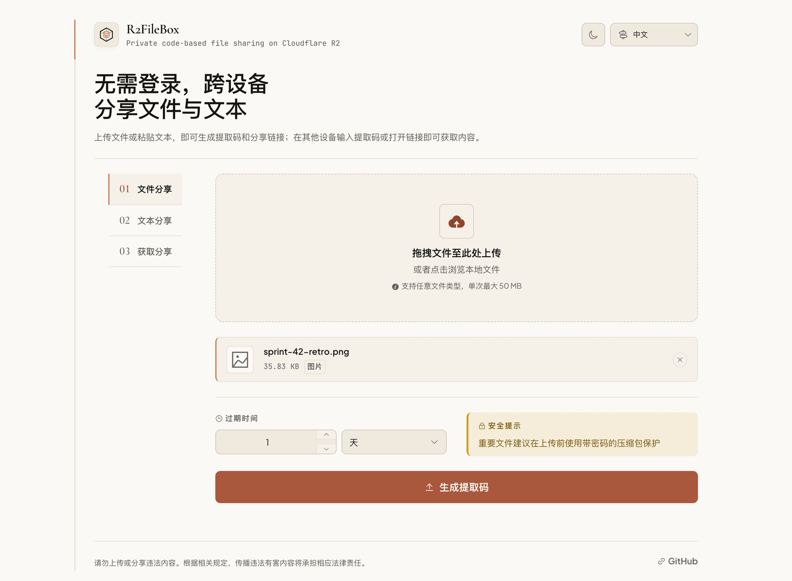
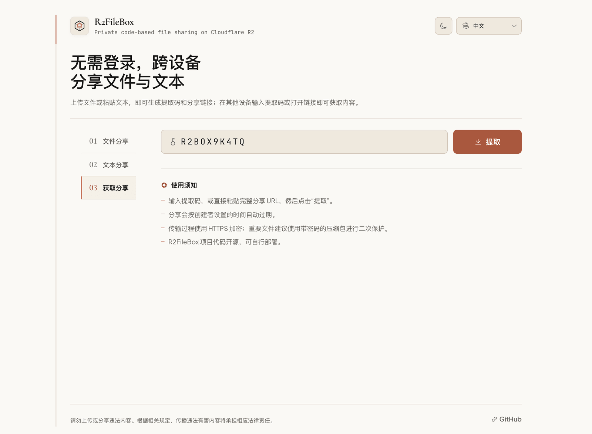
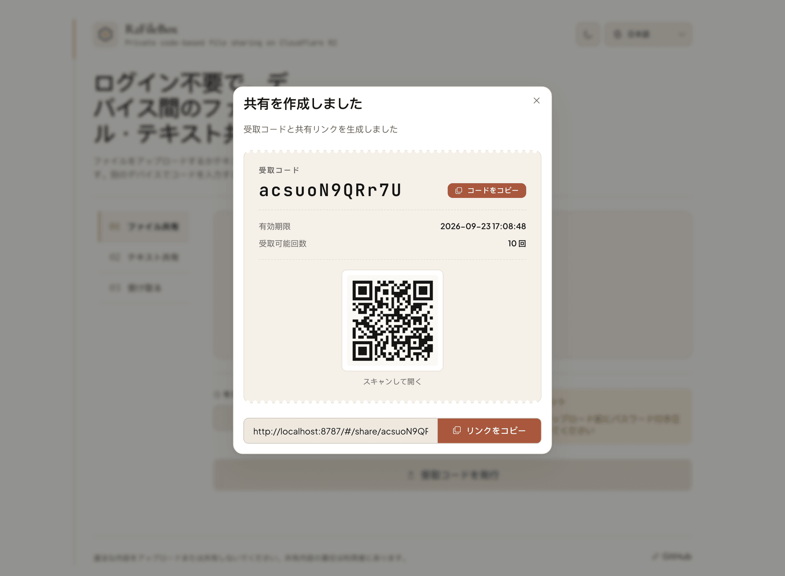
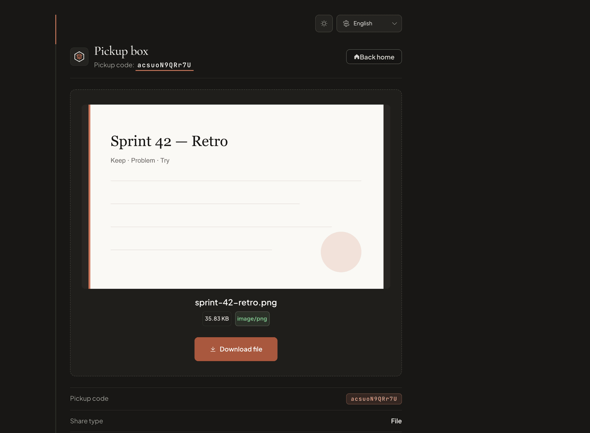
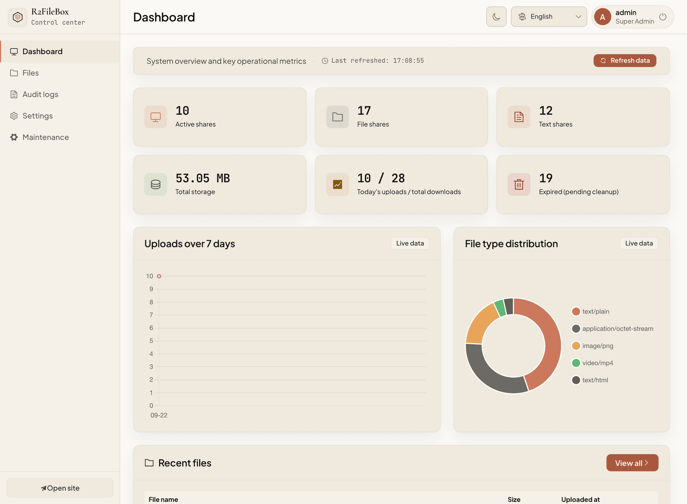
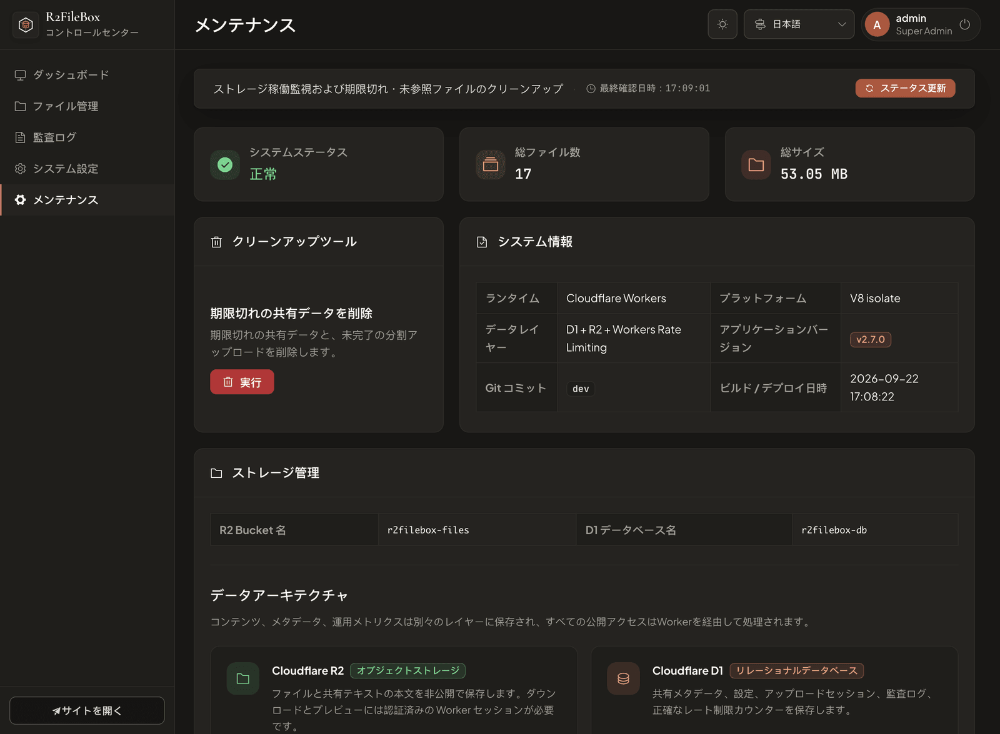

# R2FileBox

[](https://github.com/workHMZ/r2filebox/actions/workflows/ci.yml)
[](https://github.com/workHMZ/r2filebox/actions/workflows/codeql.yml)
[](https://github.com/workHMZ/r2filebox/security/dependabot)
[](https://github.com/workHMZ/r2filebox/security)
[](https://github.com/workHMZ/r2filebox/releases/latest)
[](./LICENSE)

[中文](#中文) · [English](#english) · [Deploy to Cloudflare](#deploy-to-cloudflare)

[](https://deploy.workers.cloudflare.com/?url=https://github.com/workHMZ/r2filebox)

无需注册的 Cloudflare 原生文件与文本分享服务。上传后发送提取码或完整链接，对方即可跨设备获取。

A serverless, Cloudflare-native file and text sharing service requiring no account or sign-in. Simply share a pickup code or a full URL to retrieve content on any device.

## 界面预览 / Screenshots

| File sharing | Get a share |
|:---:|:---:|
| [](./docs/screenshots/home-file-share.png) | [](./docs/screenshots/home-get-share.png) |
| **Share created** | **Pickup box** |
| [](./docs/screenshots/share-created.png) | [](./docs/screenshots/pickup-file.png) |
| **Admin dashboard** | **Maintenance and storage** |
| [](./docs/screenshots/admin-dashboard.png) | [](./docs/screenshots/admin-maintenance.png) |

---

## 中文

### 使用方式

1. 拖入一个文件，或粘贴要分享的文本。
2. 创建分享后，将提取码、完整分享 URL 或二维码发给对方。
3. 对方输入提取码、粘贴完整 URL，或直接打开链接即可获取，无需注册或登录。

### 功能亮点

- **免费额度友好 / 低成本部署**：完全基于 Cloudflare 生态构建，适合个人使用免费额度进行自托管部署。
- **Cloudflare 原生**：Hono API 与 Vue 前端运行在 Workers，正文存入私有 R2，元数据与配置存入 D1。
- **文件与文本分享**：支持 R2 Multipart 分片上传与断点续传、二维码，并在浏览器本地保留最长 24 小时的续传信息。
- **短寿命下载会话**：提取文件时签发 15 分钟 JWT Cookie；同一会话内的 HTTP Range / ETag 请求不会重复扣减提取次数，支持音视频拖动播放和断点下载。
- **双层限流与安全预览**：Workers 原生边缘限流负责粗粒度拦截，D1 时间窗口计数维持跨节点精确限制；SVG 不允许内嵌预览，并支持可选 Turnstile。
- **O(1) 存储配额**：D1 Triggers 原子维护 `storage_usage`，无需在上传热路径扫描全部分享；分片哈希校验会主动让出事件循环，避免长时间阻塞页面。
- **清晰的访问方式**：既可输入提取码，也可粘贴完整分享 URL；系统会自动解析其中的提取码。
- **多语言与主题**：支持中文、English、日本語；首次跟随系统深浅色，手动切换后会记住选择。
- **PWA**：支持安装到桌面或主屏幕，并可作为系统文本分享目标。
- **管理后台**：文件管理、审计日志、运行状态、存储信息、清理工具及运行时配置集中管理。
- **低维护**：默认每天清理过期分享，并提供 Workers 原生限流、D1 精确限流、Analytics Engine 指标和可选 Turnstile。

### 数据与安全架构

```text
上传文件 / 文本
    │
    ▼
Worker：校验、限流、生成随机提取码
    ├─ 正文 ─────────────────────────→ 私有 R2（不透明对象键）
    └─ SHA-256(Pepper:提取码) + 元数据 ─→ D1（不保存提取码明文）

输入提取码或完整 URL → Worker 提取并重新哈希 → D1 查找并原子扣减提取次数
    ├─ 文本：Worker 从 R2 读取后返回
    └─ 文件：签发 15 分钟下载会话 → Worker 从 R2 流式返回（Range / ETag）
```

默认配置不会公开 R2 Bucket，应用也不生成绕过 Worker 的对象地址。这里实现的是**服务端访问控制，不是端到端加密**：Worker 必须能读取正文才能返回内容。重要文件建议在上传前使用带密码的压缩包或其他客户端加密方式保护。

| 层级 | 技术 | 用途 |
|------|------|------|
| 边缘应用 | Hono + Cloudflare Workers | API、鉴权、安全头、流式下载、定时清理 |
| 对象存储 | Cloudflare R2 | 私有文件与文本正文 |
| 数据库 | Cloudflare D1 | 分享元数据、设置、上传会话、审计日志和精确限流 |
| 前端 | Vue 3 + Element Plus | 用户界面与管理后台，由 Workers Static Assets 托管 |
| 指标与防护 | Analytics Engine + Workers Rate Limiting | 轻量指标与边缘粗粒度限流 |

### 默认值与边界

| 项目 | 当前行为 |
|------|----------|
| 单文件上传 | 默认 `50 MiB`，管理员可配置 `1–95 MiB` |
| 应用上传上限 | `95 MiB`；这是当前应用配置与分片数量的实现边界，并非通过 Workers 使用 R2 Multipart 时的总文件上限 |
| 总存储软限制 | 默认 `8 GiB`；达到后停止创建新分享，不删除已有内容 |
| 有效期 | 默认 `24` 小时，默认最长 `168` 小时，可由管理员调整 |
| 最大提取次数 | 默认 `10` 次，可由管理员调整 |
| 自动清理 | 每天 `00:00 UTC` 处理过期分享和残留分片 |

### 管理员配置

部署后可在“全局配置”中修改站点名称与描述、文件/文本分享开关、开放上传、上传与总存储限制、有效期、最大提取次数、审计/访问日志、精确限流和 Turnstile。应用默认值存放在代码中，管理员修改后的设置存放在 D1，无需把整组默认配置写成 Worker 环境变量。

### 测试与仓库安全

```bash
npm run verify          # 配置、PWA/主题资源、三语言、类型、脚本与 Worker 测试
npm run deploy:dry-run  # 构建前端并验证 Wrangler 部署包，不上传
```

测试覆盖管理员 Cookie 鉴权、分享解析与下载、文本并发提取、Range/ETag、限流、存储计数、断点续传错误分类、运行时配置、定时清理、指标、健康检查、部署元数据、API 错误契约、URL 提取和主题初始化。

- **CI**：推送到 `main` 及 Pull Request 运行完整验证和部署 dry-run。
- **CodeQL**：对 JavaScript/TypeScript 和 GitHub Actions 进行语义 SAST，覆盖 `main`、Pull Request 和每周计划扫描。
- **Dependabot**：仓库已开启漏洞告警、安全更新，以及 npm 与 GitHub Actions 的每周版本更新 PR。
- **Secret Scanning**：仓库已开启密钥扫描和 Push Protection，尽量在敏感信息进入 Git 历史前阻止提交。

Dependabot 与 Secret Scanning 是仓库安全设置，不产生原生的 Passing check；顶部徽章因此只标记 `Enabled`，CI 与 CodeQL 徽章才反映真实工作流状态。

### 部署

需要 Node.js 24（`>=24.11.0 <25`），推荐使用 [.nvmrc](./.nvmrc) 固定的版本。

#### 命令行部署（推荐）

```bash
npm ci
npm run deploy:cf
```

首次运行会创建或显式复用 R2/D1、生成管理员密码哈希与必要密钥、应用 D1 迁移并部署 Worker。检测到现有绑定时不会自动轮换密钥。

#### Deploy to Cloudflare

点击顶部按钮，并使用：

```text
Build command:  npm run build
Deploy command: npm run deploy
```

`npm run deploy` 会先应用远程 D1 迁移，再执行 `wrangler deploy`。首次部署需要：

| Secret | 要求 |
|--------|------|
| `ADMIN_PASSWORD` | 管理员密码，16–4096 字符 |
| `CODE_HASH_PEPPER` | 使用 `openssl rand -hex 32` 生成；更换后已有提取码失效 |
| `SESSION_SECRET` | 使用 `openssl rand -hex 32` 生成；更换后已有会话失效 |

`ADMIN_USERNAME` 可选，默认为 `admin`。Turnstile 默认关闭，可在部署后从后台启用。构建时间由 Cloudflare Version Metadata 自动记录。

### 本地开发

```bash
cp .dev.vars.example .dev.vars
npm ci
npm run build
npm run db:migrate:local
npm run dev                       # http://localhost:8787
```

修改前端后重新运行 `npm run build`，Wrangler 会重新加载生成的静态资源。不要提交 `.dev.vars`、管理员凭据或生产密钥。

---

## English

### How it works

1. Drop in one file, or paste the text you want to share.
2. Send the pickup code, full share URL, or QR code after the share is created.
3. The recipient enters the code, pastes the full URL, or opens the link—no account or sign-in required.

### Highlights

- **Free-Tier Friendly**: Designed to run efficiently within Cloudflare's free tier limits, making it a highly cost-effective solution for personal self-hosting.
- **Cloudflare-native**: the Hono API and Vue frontend run on Workers, bodies stay private in R2, and metadata and settings live in D1.
- **File and text sharing**: R2 Multipart uploads, resumable upload state retained locally for up to 24 hours, and QR-code sharing.
- **Short-lived download sessions**: A 15-minute JWT cookie authorizes HTTP Range and ETag requests without repeatedly consuming the pickup allowance, enabling media seeking and resumed downloads.
- **Layered rate limiting and safe previews**: Native Workers edge limiting provides a coarse guard while D1 time-window counters enforce exact cross-location limits; SVG files are never rendered inline, and Turnstile is optional.
- **O(1) storage accounting**: D1 triggers maintain `storage_usage` atomically without scanning every share on the upload path; multipart hash verification yields to the browser event loop to keep the page responsive.
- **Simple retrieval**: enter a pickup code or paste a full share URL; R2FileBox extracts the code automatically.
- **Languages and themes**: Chinese, English, and Japanese; the first visit follows the operating-system theme, while a manual choice is remembered.
- **PWA**: installable on desktop or mobile and available as a system text share target.
- **Admin console**: files, audit logs, runtime health, storage information, cleanup tools, and runtime settings in one place.
- **Low maintenance**: Features daily auto-cleanup, native Workers rate limiting, precise D1 rate limits, Analytics Engine metrics, and optional Cloudflare Turnstile integration.

### Data and security architecture

```text
Upload file / text
    │
    ▼
Worker: validate, rate-limit, and generate a random pickup code
    ├─ Body ───────────────────────────────→ private R2 (opaque object key)
    └─ SHA-256(Pepper:pickup code) + metadata → D1 (no plaintext code stored)

Enter a code or full URL → Worker extracts and hashes it → D1 finds the share and atomically consumes one pickup
    ├─ Text: Worker reads the R2 object and returns it
    └─ File: issue a 15-minute download session → stream from R2 (Range / ETag)
```

The default configuration does not expose the R2 bucket, and the app does not generate object URLs that bypass the Worker. This is **server-side access control, not end-to-end encryption**: the Worker must be able to read content to serve it. Encrypt sensitive files before upload, for example with a password-protected archive.

| Layer | Technology | Purpose |
|-------|------------|---------|
| Edge app | Hono + Cloudflare Workers | API, authentication, security headers, streaming, scheduled cleanup |
| Object storage | Cloudflare R2 | Private file and shared-text bodies |
| Database | Cloudflare D1 | Metadata, settings, upload sessions, audit logs, and exact rate counters |
| Frontend | Vue 3 + Element Plus | Public UI and admin console through Workers Static Assets |
| Metrics and guard | Analytics Engine + Workers Rate Limiting | Lightweight metrics and coarse edge throttling |

### Defaults and limits

| Item | Current behavior |
|------|------------------|
| Single-file upload | `50 MiB` by default; configurable from `1–95 MiB` |
| Application upload ceiling | `95 MiB`; this is the current application and part-count boundary, not the total-file limit of R2 multipart uploads through Workers |
| Total-storage soft limit | `8 GiB` by default; new shares stop when reached, existing content is not deleted |
| Expiry | `24` hours by default, with a default maximum of `168` hours; admin configurable |
| Maximum pickups | `10` by default; admin configurable |
| Scheduled cleanup | Every day at `00:00 UTC` for expired shares and leftover multipart uploads |

### Admin settings

After deployment, **Settings** controls the site name and description, file/text sharing, public uploads, upload and total-storage limits, expiry, maximum pickups, audit/access logs, exact rate limits, and Turnstile. Built-in defaults live in code; administrator changes live in D1 instead of a long list of Worker variables.

### Tests and repository security

```bash
npm run verify          # config, PWA/theme assets, three locales, types, scripts, and Worker tests
npm run deploy:dry-run  # build the frontend and validate the Wrangler bundle without uploading
```

Coverage includes admin cookie authentication, share resolution and downloads, concurrent text pickup, Range/ETag, throttling, storage accounting, resumable-upload error handling, runtime settings, scheduled cleanup, metrics, health, deployment metadata, the API error contract, full-URL parsing, and theme initialization.

- **CI** runs the complete verification and deployment dry-run on pushes to `main` and on pull requests.
- **CodeQL** performs semantic SAST for JavaScript/TypeScript and GitHub Actions on `main`, pull requests, and a weekly schedule.
- **Dependabot** vulnerability alerts, security updates, and weekly npm/GitHub Actions version-update PRs are enabled.
- **Secret Scanning** and Push Protection are enabled to catch secrets before they enter Git history.

Dependabot and Secret Scanning are repository settings rather than check runs, so their badges say `Enabled`; only CI and CodeQL badges report live workflow status.

### Deploy

Node.js 24 (`>=24.11.0 <25`) is required; the version pinned in [.nvmrc](./.nvmrc) is recommended.

#### CLI (recommended)

```bash
npm ci
npm run deploy:cf
```

The first run creates or explicitly reuses R2 and D1, hashes the administrator password entered through the hidden prompt, generates the remaining required secrets, applies D1 migrations, and deploys the Worker. Existing bindings do not trigger automatic secret rotation.

#### Deploy to Cloudflare

Use the button at the top and set:

```text
Build command:  npm run build
Deploy command: npm run deploy
```

`npm run deploy` applies remote D1 migrations before `wrangler deploy`. The first deployment requires:

| Secret | Requirement |
|--------|-------------|
| `ADMIN_PASSWORD` | Admin password, 16–4096 characters |
| `CODE_HASH_PEPPER` | Generate with `openssl rand -hex 32`; rotation invalidates existing pickup codes |
| `SESSION_SECRET` | Generate with `openssl rand -hex 32`; rotation invalidates existing sessions |

`ADMIN_USERNAME` is optional and defaults to `admin`. Turnstile is disabled by default and can be enabled later in the admin console. Cloudflare Version Metadata records the build time automatically.

### Local development

```bash
cp .dev.vars.example .dev.vars
npm ci
npm run build
npm run db:migrate:local
npm run dev                       # http://localhost:8787
```

Run `npm run build` again after frontend changes so Wrangler reloads the generated assets. Never commit `.dev.vars`, admin credentials, or production secrets.

### License

Inspired by [FileCodeBox](https://github.com/vastsa/FileCodeBox) and parts of its [Go implementation](https://github.com/zy84338719/FileCodeBox). This is an independent Cloudflare Workers implementation.

**LGPL-3.0-or-later** · [LICENSE](./LICENSE) · [THIRD_PARTY_NOTICES.md](./THIRD_PARTY_NOTICES.md)
